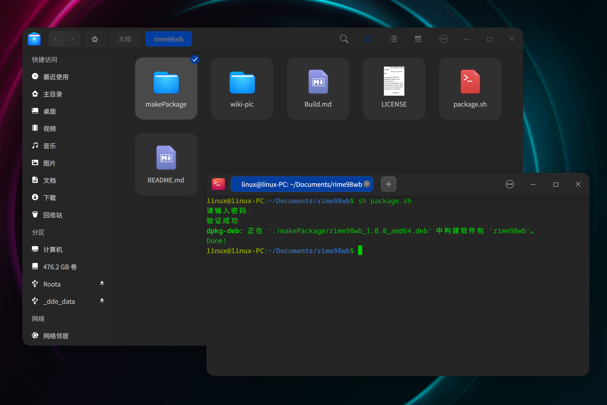

## 打包

拉取或下载本档之后，从终端进入到文件根目录：

```
sudo chmod 755 -R ./makePackage/rime98wb

dpkg -b ./makePackage/rime98wb ./makePackage

sudo chmod 777 ./makePackage/rime98wb*.deb
```
## 安装

```
sudo dpkg -i ./makePackage/rime98wb*.deb
```

## 卸载

```
sudo dpkg -r rime98wb
```

## 示例

直接使用本档提供的 `package.sh` 即可打包，如图：

- 